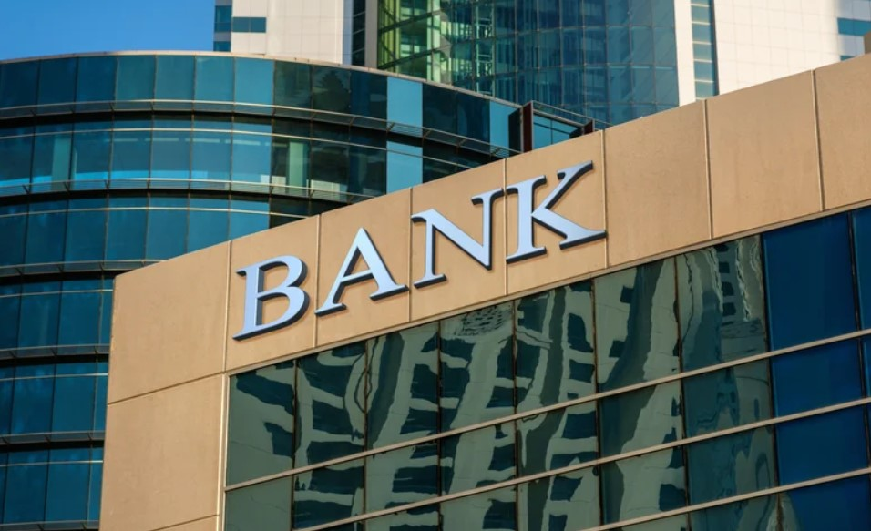
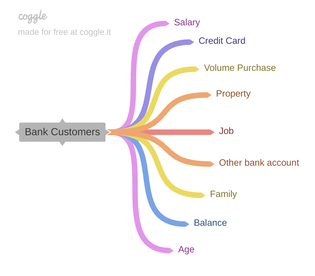
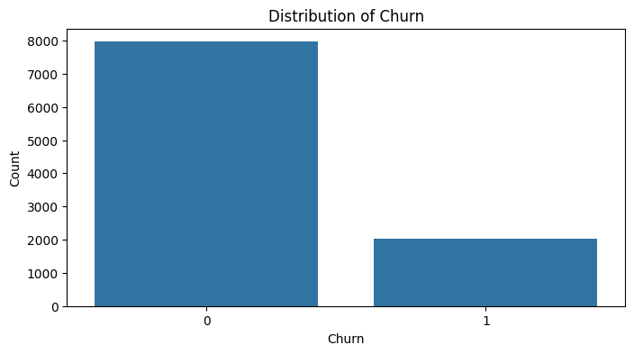
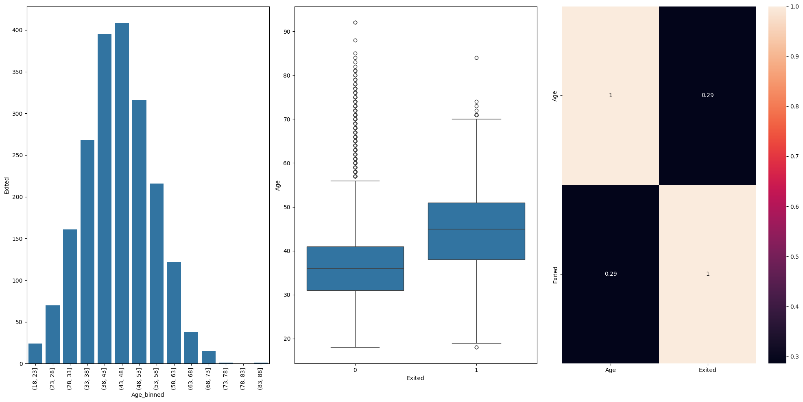
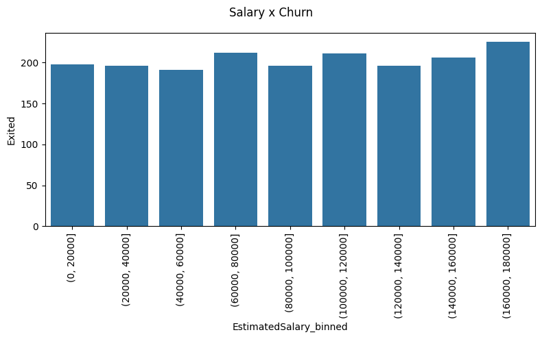
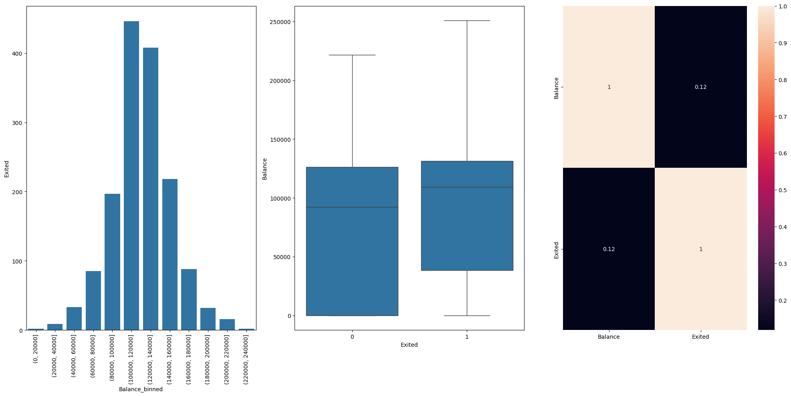
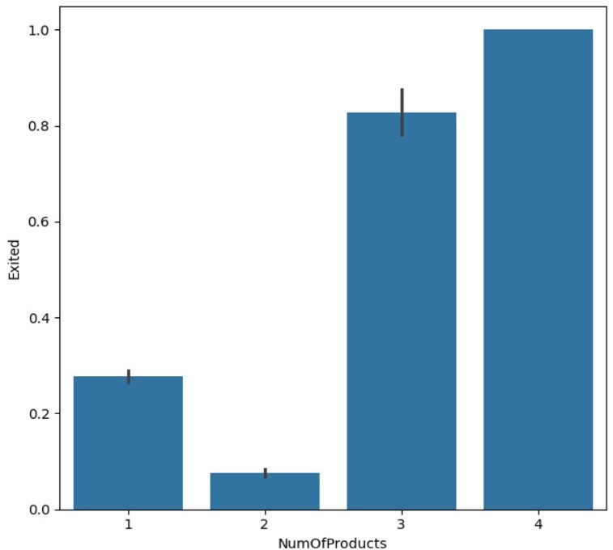

# Predição de Churn de Clientes de um Banco

## 📲 Resultado

Este projeto prevê a probabilidade de churn (cancelamento) de clientes, identificando aqueles com maior risco de encerrar a conta no banco. O modelo pode ser integrado a sistemas internos para que equipes de retenção apliquem ações preventivas personalizadas.

## 💼 Contexto de Negócio

O churn é um desafio constante no setor bancário, dado o custo elevado de aquisição de novos clientes em comparação à retenção dos atuais. Este projeto tem como objetivo minimizar a perda de clientes, contribuindo para um aumento na fidelidade e na receita do banco.

## 📈 Objetivo do Projeto

Construir um modelo preditivo que identifique com precisão os clientes em risco de churn, ajudando o Banco a priorizar ações de retenção para melhorar a satisfação e o engajamento dos clientes.

## 📋 Planejamento

Este projeto segue o ciclo CRISP (Cross-Industry Process for Data Science), uma metodologia ágil e iterativa, para garantir a entrega de uma solução end-to-end. Cada fase do ciclo foi utilizada para estruturar o projeto:

- **Entendimento do Negócio**: Definir os fatores críticos para o churn.
- **Entendimento dos Dados**: Realizar uma análise exploratória dos dados de clientes.
- **Preparação dos Dados**: Limpeza, transformação e seleção das variáveis mais relevantes.
- **Modelagem**: Testes e treinamento de modelo Random Forest.

## 📊 Tecnologias Utilizadas

- **Linguagem**: Python
- **Bibliotecas**: Pandas, Numpy, Scikit-Learn
- **Ferramentas de Visualização**: Matplotlib, Seaborn
- **Ambiente de Desenvolvimento**: Jupyter Notebook

## 🔍 Principais Insights

O relatório de classificação mostra uma acurácia de 87%, com maior precisão e recall para clientes não-cancelados em comparação aos cancelados. A importância das variáveis indica que Idade, Salário Estimado e Pontuação de Crédito são os principais preditores de churn. Alguns insights:

- Taxa geral de churn: 20,37%

- Clientes de 38 a 53 anos têm maior probabilidade de churn. Seguros de vida e previdência podem reter parte deste público

- Produtos exclusivos e qualificados podem reter clientes de alta renda

- Entender as razões para clientes com saldos altos deixarem o banco; retornos diários competitivos para saldo em conta pode retê-los

- Foco em oferecer produtos para clientes que possuam apenas um, para que fiquem com dois. Clientes com 3-4 produtos têm altas taxas de churn

- Oferecer produtos de crédito e fincanciamento com taxas competitivas podem reter clientes com alta pontuação de crédito

## 📝 Conclusão

O modelo desenvolvido fornece ao Banco uma visão detalhada dos clientes em risco de churn, permitindo ações preventivas. Isso contribui para um maior nível de retenção de clientes e para a manutenção da receita e crescimento do banco.
